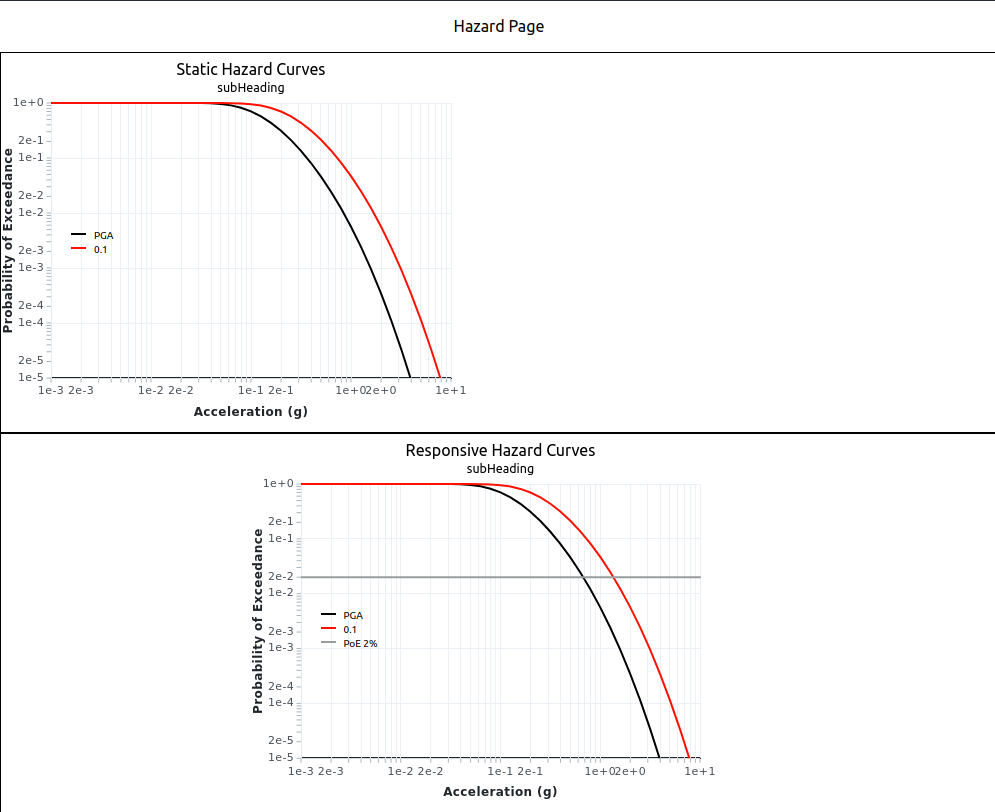

### HazardCurves/ResponsiveHazardCurves

The `<HazardCurves />` and `<ResponsiveHazardCurves />` components render an xychart with one or multiple curves. The only difference is that `HazardCurves` receives a static width prop, and `ResponsiveHazardCurves` needs to be wrapped in a responsive container and it will resize according to its parent size.



```
import React from 'react';
import { HazardCurves, ResponsiveHazardCurves } from '@gns-science/toshi-nest';

import { hazardChartsData } from '../constants/hazardChartsData';

const HazardPage = () => {
  const scalesConfig = {
    x: { type: 'log', domain: [1e-3, 10] },
    y: { type: 'log', domain: [1e-5, 1] },
  };

  const colors = {
    PGA: '#000000',
    0.1: '#FE1100',
  };

  return (
    <>
      <div style={{ border: 'solid black 1px', width: '100vw' }}>
        <HazardCurves curves={curves} width={500} scalesConfig={scalesConfig} colors={colors} heading={'Static Hazard Curves'} subHeading={'subHeading'} gridNumTicks={5} POE={'None'} />
      </div>
      <div style={{ border: 'solid black 1px', width: '100vw', display: 'flex', justifyContent: 'center' }}>
        <div style={{ width: '50vw', display: 'flex', justifyContent: 'center' }}>
          <ResponsiveHazardCurves curves={curves} scalesConfig={scalesConfig} colors={colors} heading={'Responsive Hazard Curves'} subHeading={'subHeading'} gridNumTicks={5} POE={'2%'} />
        </div>
      </div>
    </>
  );
};

export default HazardPage;
```

**HazardCurvesProps**
| Prop |Type |
| ----------- | ----------- |
| curves | `Record<string(curveKey), XY[]>`|
| scalesConfig | <pre>{<br> x: {<br> type : `'log' | 'linear' | 'band',`<br> domain: number[],<br> }<br > y: {<br> type : `'log' | 'linear' | 'band',`<br> domain: number[],<br> }<br >} </pre>|
| colors | `Record<string(curveKey), string(color)>`|
| width   **only when using static HazardCurves*` | number |
| heading? | string |
| subHeading? | string |
| gridNumTicks | number |
| POE | `'None' | '2%' | '10%' `|

[Home](../../README.md)
