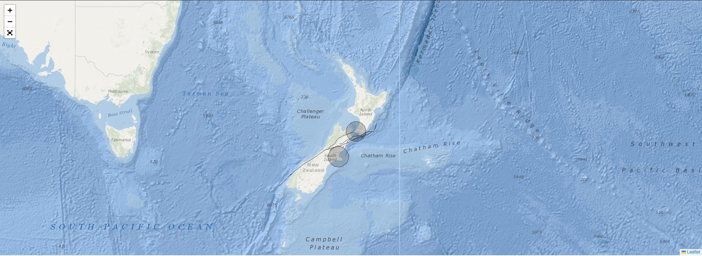

### Leaflet Map
The `<LeafletMap />` component renders an interactive map with layers of geojson data displayed over it. The user can zoom in or out, move around the map and make it full screen.



```
import React from 'react';
import { LeafletMap } from '../component-lib';

const LeafletMapPage = () => {
  const rupturesData = solvisResponse.ruptures;
  const locationsData = solvisResponse.locations;
  const providerUrl = 'https://server.arcgisonline.com/ArcGIS/rest/services/Ocean_Basemap/MapServer/tile/{z}/{y}/{x}';
  const showLocation = true;
  const zoom = 5;
  const nzCentre = [-40.946, 174.167];

  return <LeafletMap zoom={zoom} nzCentre={nzCentre} providerUrl={providerUrl} rupturesData={rupturesData} locationsData={locationsData} showLocation={showLocation} />;
};

export default LeafletMapPage;
```

**LeafletMapProps**
| Prop | Type |
| ------- | -------- |
| rupturesData | string |
| locationsData | string |
| nzCentre | LatLngExpression |
| zoom | number |
| providerUrl | string |
| showLocation | boolean |

[Home](../../README.md)